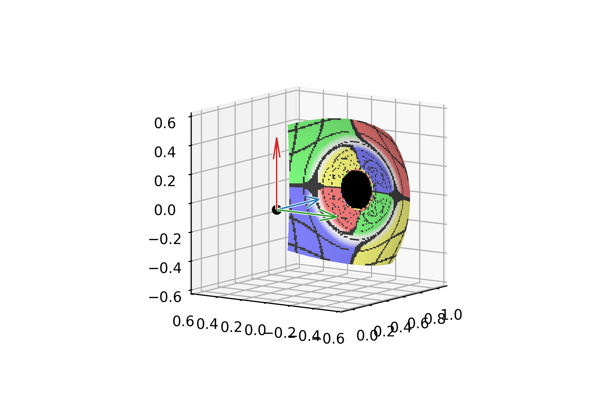

# RaytracingX

A relativistic raytracing thorn in the CarpetX framework.

Written by Noelle Feist /<njf4697@rit.edu/> with code adapted from Jhon Sebastián Moreno Triana <github: Jh0mpis> in
collaboration with Manuela Campanelli, Yosef Zlochower, Liwei Ji, and Scott Noble.

This thorn creates a grid of mass-less particles (sometimes referred to as photons in the code) set to move in
different directions originating at a single point, then integrates their corresponding geodesics backwards until
they either reach the simulation boundaries, an event horizon, or the photosphere (WIP). The geodesic integration
is modified from and has [GInX](https://github.com/Jh0mpis/GInX) as a prerequisite. The geodesic initial data and
integration of geodesics follows [Bohn et al. (2015)](https://arxiv.org/pdf/1410.7775). That point is then taken to be
the starting point for integration of the relativistic radiative transfer equation, and the specific intensity is
integrated back to the camera (WIP).

**Any interaction with matter (including radiative transfer) is currently a work in progress.**

## Interaction with GInX

While much of the code is shared with [GInX](https://github.com/Jh0mpis/GInX), only the parameters for particle
output and banned regions from `GInX/BaseParticlesContainer` are used. Additionally, the thorn `ParticlesContainer`
by default runs a test evolution of particles. Thus, it is recommended to set `ParticlesContainer::run_test = false`
in the parameter file.

## Modes of Operation

This code currently operates with two modes, using the fast-light approximation (all raytracing happens in a single
simulation iteration) and numerical spacetime (WIP).

## Camera and Image Setup

The camera is defined by a position `camera_pos`, a velocity `camera_vel`, a pointing direction `camera_point`, and
an upwards direction `camera_up`. Each of these variables should be defined as a 3-vector in the simulation frame in
the parameter file. Note that the camera's position is not evolved over time, so if two snapshots are requested, they
will be from the same position regardless of the camera's velocity.

The edges of the image are defined by the horizontal and vertical field of view parameters `horizontal_fov` and
`vertical_fov` given in degrees. The resolution is given by the number of pixels across the width and height of the 
image `num_pixels_width` and `num_pixels_height`. These parameters should be set in the parameter file.

One mass-less particle is created for each pixel. The initial position of each particle is set to `camera_pos` and 
equations for the initial velocity are given by [Bohn et al. (2015)](https://arxiv.org/pdf/1410.7775). In effect, 
each initial velocity is a normalized 4-vector in the direction from `camera_pos` to the center of each pixel.
Each velocity can be thought of as offset by $d\theta=\frac{\text{FOV}}{\text{num. pixels}}$ in the horizontal and
vertical directions, though this is not how they are calculated. **This is different from traditional raytracing, 
where the image is defined by a rectangular grid set a distance away from the camera.** This image created by this
code code can be thought of as a grid on the surface of a sphere centered on the camera. Due to this, the raw image
is distorted in a 'fish-eye' manner. This distortion can be undone, and an example of this is shown in
`post_processing/debug_image.ipynb`.

Each pixel is given an index from which the image can be constructed. This starts from zero in the top-left corner and
increments left-to-right, then up-to-down. An example is shown in the image below, where the camera is placed at the
black dot, the spatial components of the camera basis vectors given from the Gram-Schmidt process from `camera_point` 
and `camera_up` (with the addition of a third vector in the 'right' direction) are shown in blue, red, and green
respectively.

Since the geodesics are evolved backwards, the *actual* initial velocity has the spatial components reversed.

## Evolution Details

## Output Notes
